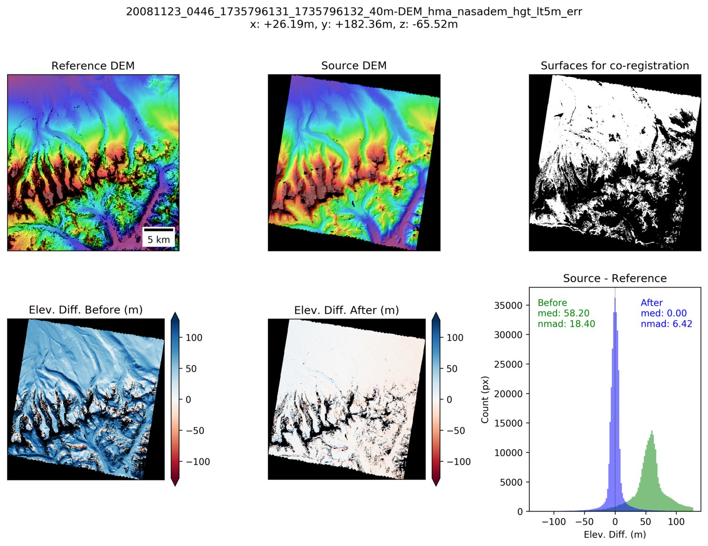
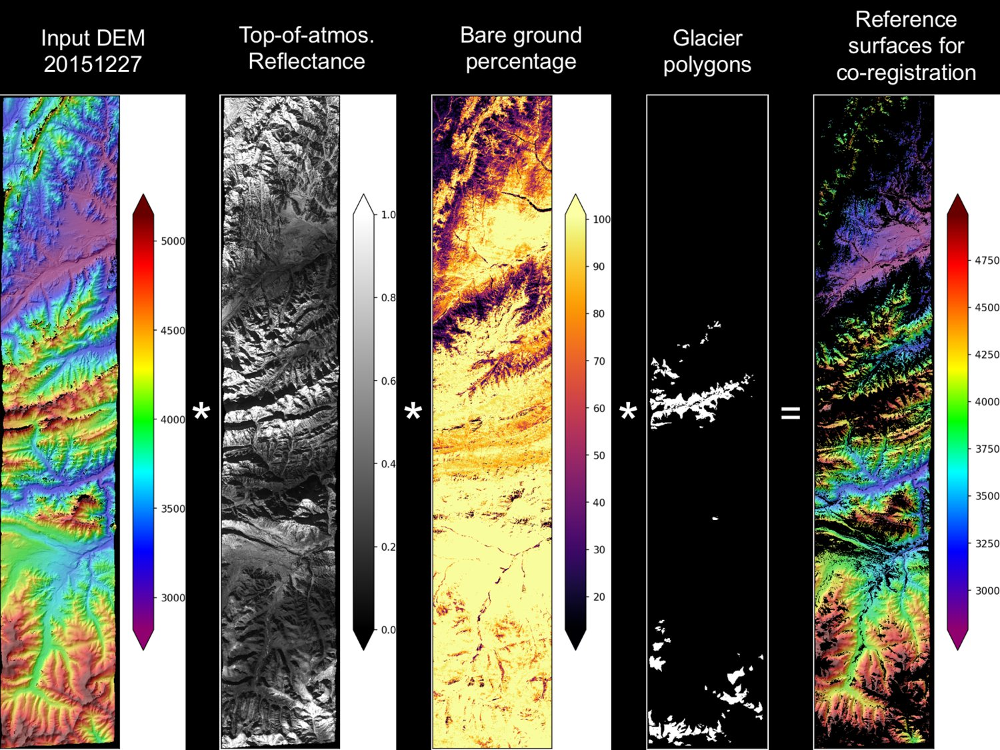
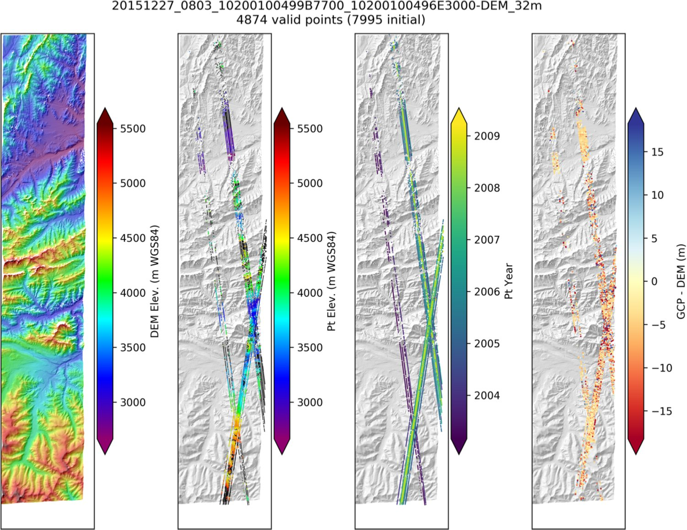

# demcoreg
Python and shell scripts for co-registration of rasters, specifically horizontal and vertical alignment of digital elevation models (DEMs).

## Overview
All DEMs have some horizontal and vertical geolocation error.  It is important to remove relative offsets when differencing DEMs for elevation change analyses.  These tools offer several options to solve this problem.  Most solve for the sub-pixel horizontal shift and vertical offset required to minimize errors over "static" control surfaces.  The ASP `pc_align` tool can also solve for more complex transformations with rotations and scaling. 

## Features
- Multiple co-registration algorithms:
    - Automated, iterative implementation of the algorithm outlined by [Nuth and Kaab (2011)](https://www.the-cryosphere.net/5/271/2011/tc-5-271-2011.html)
    - Iterative Closest Point (ICP) as implemented in ASP `pc_align`
    - Normalized cross-correlation (NCC) with sub-pixel refinment
    - Sum of absolute differences (SAD)
- Automatic determination of static control surfaces (i.e., exposed bedrock) and masking for a user-specified combination of:
    - RGI glacier polygons
    - Land-use/Land-cover classification:
        - [National Land Cover Database (NLCD) 30-m products for CONUS](https://www.usgs.gov/centers/eros/science/national-land-cover-database?qt-science_center_objects=0#qt-science_center_objects) with pre-configured filter combinations (e.g., 'not_forest+not_water')
        - [Global Bare Ground 30-m products](https://glad.umd.edu/dataset/global-2010-bare-ground-30-m)
    - Snow mask: 
        - Thresholded MODSCAG fSCA from ~2-week period around DEM timestamp
        - Thresholded SNODAS model
        - Thresholded Top-of-atmosphere reflectance values from corresponding orthoimage (requires pregeneration)

### Some useful command-line utilities (run with `-h` option for complete usage)
- `dem_align.py` - robust raster DEM co-registration (e.g., Nuth and Kaab [2011]) for surfaces with variable slope and aspect
- `dem_mask.py` - generate mask of snow-free rock surfaces using reflectance, LULC, SNODAS, MODSCAG
- `pc_align_wrapper.sh` - wrapper around NASA Ames Stereo Pipeline pc_align utility for iterative closest point co-registration 
- `apply_dem_translation.py` - update geotransform and remove vertical offset
- `compute_diff.py` - simple DEM difference calculation with intuitive resampling options
- `robust_stats.py` - print out robust statistics for sampled DEM differences before/after co-registration

## Sample output 
### dem_align.py 
Sample command: `dem_align.py ref_dem.tif src_dem.tif`

### dem_mask.py
Sample command: `dem_mask.py --toa --bareground --glaciers src_dem.tif`

### filter_glas.py output

## Example applications
#### High-mountain Asia
- Co-registration of ~35000 high-resolution DEMs from multiple sensors
- https://github.com/dshean/hma_mb_paper

#### Pine Island Glacier, Antarctica
- Least-squares optimization to correct for offset and "tilt" of ~800 high-resolution DEMs with limited ground control
- https://github.com/dshean/pig_dem_meltrate

## Documentation
http://demcoreg.readthedocs.io (autogenerated from code, outdated)

## Installation
We recommend following the "developer install" instructions below, to obtain latest features/bugfixes.  Alternatively, one can install the latest release from PyPI with: `pip install demcoreg`.

### Building from latest source (recommended)
1. Clone the repository: `git clone https://github.com/dshean/demcoreg.git`
2. Perform developer install with pip: `pip install -e demcoreg`
    - *The -e flag ("editable mode", setuptools "develop mode") will allow you to modify source code and immediately see changes.*
3. Optionally, append the demcoreg subdirectory containing scripts to your PATH: `export PATH=${PATH}:$PWD/demcoreg/demcoreg` (replacing `$PWD` with the absolute path to the cloned demcoreg repository)
    - *To make this permanent, add that line to your shell config file (e.g., ~/.bashrc).* 
    
### Beginner's Guide
If the above is unfamiliar, or you are new to Python, bash, and/or git/github, see additional notes and instructions here: [Beginners Guide](demcoreg/docs/beginners_doc.md).

### Core dependencies 
- [GDAL/OGR](http://www.gdal.org/)
- [NumPy](http://www.numpy.org/)
- [pygeotools](https://github.com/dshean/pygeotools)

### Optional dependencies (needed for some functionality) 
- [matplotlib](http://matplotlib.org/)
- [SciPy](https://www.scipy.org/)
- [NASA Ames Stereo Pipeline (ASP)](https://ti.arc.nasa.gov/tech/asr/intelligent-robotics/ngt/stereo/)

## License

This project is licensed under the terms of the MIT License.

### Citation

If you use any of this software for research applications that result in publications, please cite:

Shean, D. E., O. Alexandrov, Z. Moratto, B. E. Smith, I. R. Joughin, C. C. Porter, Morin, P. J., An automated, open-source pipeline for mass production of digital elevation models (DEMs) from very high-resolution commercial stereo satellite imagery, ISPRS J. Photogramm. Remote Sens, 116, 101-117, doi: [10.1016/j.isprsjprs.2016.03.012](https://doi.org/10.1016/j.isprsjprs.2016.03.012), 2016. 
